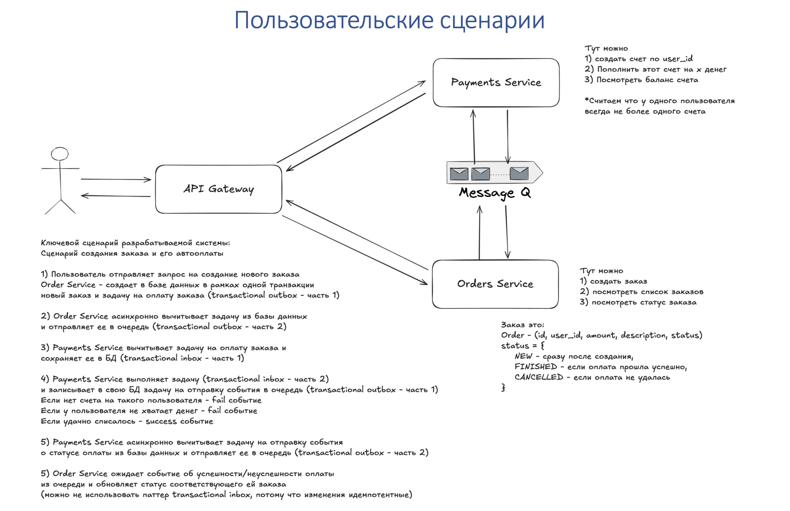
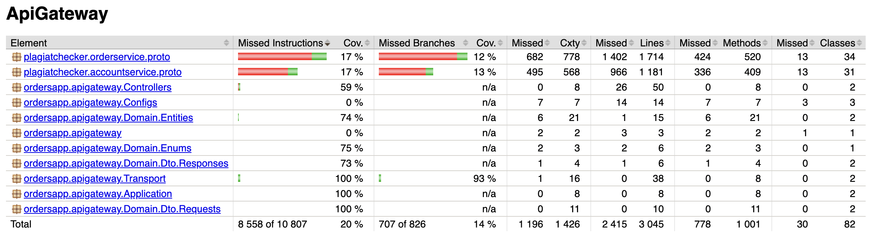
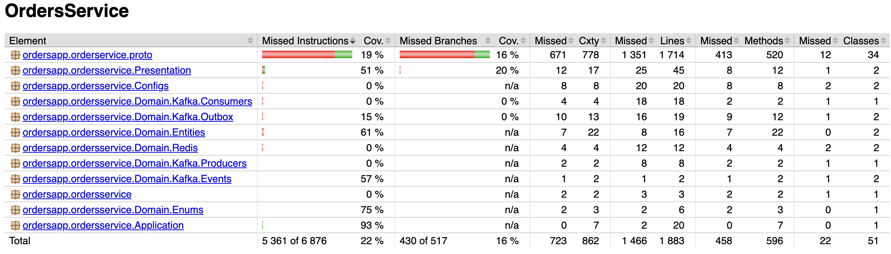
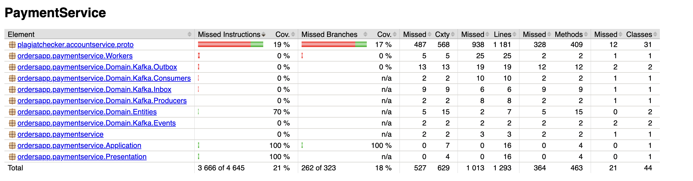

## Микросервисное приложение для создания и оплаты заказов


### Полезные ссылки для тестирования:
http://localhost:8081/swagger-ui/index.html#/ - ссылка на Swagger\
http://localhost:8085/ui/clusters/local/brokers - Kafka\
http://localhost:3000 - web

### Запуск приложения

```bash
make service-up #запуск всего приложения
make service-rerun #перезапуск приложения
```

### Принцип работы и пользовательские сценарии

#### Приложение разделено на три микросервиса: ApiGateway - отвечает за взаимодействие с пользователем (в частности, с вебом), использует протокол http; OrdersService - отвечает за создание, хранение заказов, а также контролирует обновление их статусов и уведомляет фронтенд об этих обновлениях, PaymentService - отвечает за создание банковских счетов, их пополнение, оплату товаров.
#### Для взаимодействия между ApiGateway и двумя другими сервисами используется gRPC. 
#### Для реализации оплаты заказов нужна exactly once гарантия. Для ее реализации используются паттерны transactional inbox и outbox в PaymentService и Transactional Outbox в OrderService. 
#### Для реализации подписки пользователей на события обновления статуса товаров используется протокол передачи данных WebSocket. Для создания "запроса" на уведомление фронтенда об изменениях используется Redis pub/sub (для чего отдельно поднят redis), что дает возможность разворачивать несколько инстансов сервиса. 
#### Каждый микросервис реализован с соблюдением принципов чистой архитектуры.
#### Принцип работы и пользовательские сценарии полностью реализуют схему ниже:



### Веб-приложение

Веб-приложение реализовано на языке java script с использованием фреймворка react. При входе пользователь должен ввести свой id.\
Приложение состоит из двух страниц: страницы заказов и страницы счетов. Между ними можно переключаться, нажимая кнопку в верхнем левом углу экрана\

* На странице заказов пользователь видит список своих заказов, их payload и статусы. Также Есть функционал создания нового заказа. При изменении статуса любого заказа из списка появляется уведомление в правом нижнем углу экрана. Подписка фронтенда на обновление статуса реализована с помощью протокола WebSocket.
* На странице счета пользователь видит свой баланс, а также может пополнить его, указав сумму пополнения. 

### Тестирование

Реализованы юнит-тесты для наиболее важных классов приложения: транспортных классов в ApiGateway, без которых всё приложение не будет отвечать, а также для транспортных классов и классов бизнес-логики в OrdersService и PaymentService.\
**NB:** непокрытые классы - это, в основном, сгенерированный для grpc код. 





